# Функциональные требования для сервиса, предназначенного для поиска, просмотра, бронирования и заказа услуг

Функциональные требования, определяющие поведение системы для работы с базой данных и обеспечивающей работу веб-сервиса по поиску, просмотру, бронированию и заказу услуг.

---

## 1. Регистрация и авторизация

### 1.1. Пользователь

#### 1.1.1. Регистрация
- Возможность регистрации пользователей.
- Пользователь заполняет форму, включающую обязательные поля: 
    - ФИО
    - номер телефона
    - пароль
- После заполнения формы пользователю отправляется смс для подтверждения номера телефона.
- Возможность регистрации через сторонние сервисы:
    - ВК
    - Госуслуги

#### 1.1.2. Верификация

##### 1.1.2.1. Загрузка паспорта
- Возможность загрузить паспорт после регистрации.
- Возможность подтянуть паспорт из госуслуг.
- После подтверждения паспорта указание в профиле "Документы проверены".
- ФИО с паспорта указывается в профиле.

##### 1.1.2.2. Указание почты
- Возможность указать почту после регистрации.
- После указания почты направляется письмо с подтверждением.

### 1.2. Компании

#### 1.2.1. Регистрация поставщиков услуг
- Зарегистрированный пользователь может зарегистрировать свою компанию, если у него проверены документы.
- Если пользователь имеет хотя бы одну компанию, то в профиле отображается, что он поставщик услуг.
- Если пользователь имеет хотя бы одну компанию, то в профиле отображается список его компаний.

#### 1.2.2. Регистрация компании
- При регистрации компании пользователь заполняет форму, включающую обязательные поля:
    - название
    - адрес

#### 1.2.3. Верификация компании
- Возможность приложить документы после регистрации.
- Возможность указать почту после регистрации.
- После указания почты направляется письмо с подтверждением.

### 1.3. Регистрация администратора
- Администратором можно стать через владельца платформы - назначается вручную через панель управления.

### 1.4. Авторизация пользователей
- Вход в систему, используя:
    - адрес электронной почты и пароль.
    - номер телефона и пароль.
- Восстановление забытого пароля через:
    - электронную почту.
    - СМС на указанный номер телефона.

---

## 2. Управление профилем

### 2.1. Профиль пользователя
- Пользователь может:
    - просматривать своё ФИО.
    - редактировать своё ФИО, если паспорт еще не подтверждён.
    - просматривать список своих контактов.
    - редактировать список своих контактов.
    - добавить контакт.
    - удалить контакт.
    - просматривать список своих избранных компаний.
    - редактировать список своих избранных компаний.
    - добавить компанию в избранное.
    - удалить компанию из избранного.
    - просматривать список своих избранных услуг.
    - редактировать список своих избранных услуг.
    - добавить услугу в избранное.
    - удалить услугу из избранного.
    - сменить свою почту с подтверждением через СМС.
    - просматривать свой номер телефона.
    - сменить свой номер телефона при условии подтверждения через СМС на текущий номер телефона.
    - оставить заявку на смену своего номера телефона если нет доступа к текущему номеру телефона.
    - просматривать историю заказанных услуг.
    - просматривать статус текущих заказов.
    - просматривать свои оставленные отзывы.
    - редактировать список типов входящих уведомлений.

### 2.2. Профиль поставщика услуг
- Поставщик может просматривать список своих компаний.
- Пользователь может редактировать компанию, если у него есть на это права.

### 2.3. Профиль компании
- Создатель компании может создавать роли для управления его компанией с определенными правами.
- Создатель компании может назначать роли пользователям.
- Создатель компании может вывести деньги с внутреннего счёта в сервисе.
- Пользователь, имеющий роль и соответствующее право, для компании может:
    - редактировать описание.
    - добавить фотографии.
    - редактировать список фотографий.
    - удалить фотографии.
    - добавить видео.
    - редактировать список видео.
    - удалить видео.
    - добавить контакт.
    - редактировать список контактов.
    - удалить контакт.
    - редактировать геолокацию.
    - добавить категорию.
    - редактировать категорию.
    - удалить категорию.
    - добавить ключевое слово.
    - редактировать список ключевых слов.
    - удалить ключевое слово.
    - сменить почту компании с подтверждением через СМС.
- Пользователь, имеющий роль и соответствующее право, может создать услугу, заполнив форму, включающую обязательные поля:
    - название услуги
    - описание услуги
- Любой пользователь может просмотреть статистику компании по: 
    - количеству заказов в каждый день
    - отзывам
    - рейтингу
    - посещаемости (количество переходов на страницу компании)

### 2.4. Профиль услуги
- Пользователь, имеющий роль и соответствующее право, может для услуги:
    - создать (требует модерации администратором перед публикацией).
    - редактировать название.
    - редактировать описание.
    - добавить фотографии.
    - редактировать список фотографий.
    - удалить фотографии.
    - добавить видео.
    - редактировать список видео.
    - удалить видео.
    - добавить контакт.
    - редактировать список контактов.
    - удалить контакт.
    - добавить геолокацию.
    - редактировать геолокацию.
    - удалить геолокацию.
    - добавить категорию.
    - сменить категорию.
    - удалить категорию.
    - добавить ключевое слово.
    - редактировать список ключевых слов.
    - удалить ключевое слово.
    - добавить временной слот.
    - редактировать список временных слотов.
    - удалить временной слот.
    - добавить способ оплаты.
    - редактировать список способов оплаты.
    - удалить способ оплаты.
    - добавить промокод.
    - редактировать список промокодов.
    - удалить промокод.
    - установить срок отмены заказа.
    - редактировать срок отмены заказа.
    - удалить срок отмены заказа (заказ по умолчанию можно удалить в любой момент перед установкой статуса "в процессе").
    - установить срок редактирования заказа.
    - редактировать срок редактирования заказа.
    - удалить срок редактирования заказа (заказ по умолчанию можно редактировать в любой момент перед установкой статуса "в процессе").
- Любой пользователь может просмотреть статистику конкретной услуги по: 
    - количеству заказов в каждый день
    - отзывам
    - рейтингу
    - посещаемости (количество переходов на страницу услуги)

### 2.5. Административный профиль
- Администратор может:
    - просматривать профили пользователей.
    - блокировать профили пользователей с указанием причины.
    - просматривать компании.
    - блокировать компании с указанием причины.
    - просматривать услуги компаний.
    - блокировать услуги компаний с указанием причины.
    - утверждать документы компаний.
    - отклонять документы компаний.
    - просматривать отзывы к компаниям.
    - удалять отзывы к компаниям.
    - просматривать отзывы к услугам.
    - удалять отзывы к услугам.
- Администрирование перечня:
    - категорий компаний.
    - субкатегорий компаний. 
    - категорий услуг.
    - субкатегорий услуг. 
    - тегов для поиска.

---

## 3. Каталог и поиск

### 3.1. Категоризация и навигация
- Пользователь может найти компанию по категории или подкатегории.
- Пользователь может найти услугу по категории или подкатегории.
- Пользователь может фильтровать компании по параметрам:
    - местоположение
    - рейтинг
    - категория компании
- Пользователь может фильтровать услуги по параметрам:
    - местоположение
    - цена
    - рейтинг
    - категория услуги
    - наличие скидок
- Пользователь может сортировать результаты по:
    - релевантности
    - рейтингу
    - цене
    - новизне

### 3.2. Поиск услуг
- Пользователю при поиске в поисковой строке выдается результат по:
    - ключевым словам
    - названиям
    - описаниям
    - тегам
- При вводе запроса в поисковую строку пользователю предлагаются варианты автодополнения.
- История поисковых запросов сохраняется.
- История поисковых запросов высвечивается при поиске в поисковой строке.
- Пользователь может почистить свою историю поиска.

---

## 4. Бронирование и заказ услуг

### 4.1. Процесс бронирования
- Система должна предоставлять календарь и возможность выбора свободных временных слотов для бронирования услуг.
- Клиент может сформировать заказ с выбором услуги и дополнительной информацией:
    - адрес
    - комментарий
- После оформления заказа отправляется уведомление пользователю с соответствующей ролью в компании для подтверждения бронирования.

### 4.2. Оплата услуг
- Система должна поддерживать онлайн-оплату с помощью:
    - СБП
    - привязки карты
    - QR кода
- Возможность оплаты на внутренний счёт компании в сервисе.
- Автоматический расчет общей стоимости услуги с учетом скидок и примененных промокодов.
- Поддержка возврата средств при отмене услуги.
- Хранение информации по завершённым платежам, статусу транзакций и квитанциям для просмотра пользователей с соответствующей ролью в компании.

### 4.3. Управление заказами
- Возможность компании менять статус заказов (новый, подтверждён, в процессе, завершён, отменён).
- Возможность отслеживания статусов заказа (новый, подтверждён, в процессе, завершён, отменён) для клиентов.
- Система ведёт лог изменений статусов и действий, связанных с заказом, для просмотра админом (фиксация автора изменения, времени, предыдущего и нового статуса).
- Клиент может отменить или изменить заказ в пределах установленных компанией сроков, а компания — согласовать изменения.

---

## 5. Отзывы и рейтинг

### 5.1. Оставление отзывов
- Клиенты могут:
    - оставить отзыв после оказания услуги (отправляется администрации на согласование), указав:
        - оценку по пятибальной шкале
        - тело отзыва (опционально)
        - приложить фото
        - приложить видео
    - редактировать свой отзыв в течение 7 дней (отправляется администрации на согласование).
    - удалить свой отзыв в течение 7 дней.

### 5.2. Модерация отзывов
- Администраторы могут:
    - утвердить отзыв.
    - не утвердить отзыв.
    - утвердить изменения отзыва.
    - не утвердить изменения отзыва.
- Система должна предусматривать алгоритмы автоматической проверки на спам.
- Пользователи с соответствующей ролью в компании могут отвечать на отзывы клиентов.

### 5.3. Система рейтинга
- Расчёт среднего рейтинга на основе оценок клиентов:
    - для услуг
    - для компаний
- Рейтинг пересчитывается в реальном времени при добавлении новых отзывов.
- Рейтинг отображается :
    - на страницах услуг
    - на страницах компаний
    - в поисковых результатах

---

## 6. Уведомления и коммуникация

### 6.1. Уведомления пользователей
- Система отправляет уведомления пользователям на почту и в личный кабинет о: 
    - регистрации
    - изменении данных
    - подтверждении заказа
    - изменении статуса заказа
- Система отправляет уведомления компаниям на почту и в личный кабинет о: 
    - регистрации
    - изменении данных компании
    - добавлении услуги
    - изменении данных услуги
    - подтверждении заказа
    - изменении статуса заказа
- Система поддерживает функционал подписки на определенные типы уведомлений.
- Реализация личного кабинета с возможностью обмена сообщениями между клиентами и компаниями.

### 6.2. Чат и поддержка
- Возможность оперативной коммуникации между клиентом, поставщиком и администрацией.
- Система сохраненяет историю сообщений в диалогах.

---

## 7. Управление контентом и административный функционал

### 7.1. Панель администратора
- Просмотр страниц клиентов, компаний и услуг.
- Редактирование страниц клиентов, компаний и услуг.
- Блокировка клиентов, компаний и услуг.
- Удаление клиентов, компаний и услуг.
- Возможность утверждения/отклонения:
    - создание услуг
    - изменение услуг
    - отзывов
    - изменений отзывов
- Доступ к аналитике использования системы, заказов, посещаемости, отзывов и рейтингов.

### 7.2. Управление данными каталога
- Добавление категорий и подкатегорий услуг.
- Редактирование категорий и подкатегорий услуг.
- Удаление категорий и подкатегорий услуг.

### 7.3. Логи и аудит
- Система должна вести журнал действий пользователей и администраторов (регистрация, вход, изменения данных, бронирование и т.д.).
- Возможность формирования отчётов для анализа активности и выявления нарушений.

---

## 8. Интеграция с внешними системами

### 8.1. Интеграция с платежными сервисами
- Реализация обмена данными с внешними платёжными системами для проведения транзакций.
- Обеспечение шифрования данных при проведении платежей.

### 8.2. Интеграция с картографическими сервисами
- Интеграция с картографическими сервисами (например, Яндекс.Карты, Google Maps) для отображения адресов компаний и услуг.

### 8.3. Интеграция с системами аналитики
- Возможность интеграции с аналитическими системами для мониторинга посещаемости, конверсии и прочих ключевых показателей.

---

## 9. Дополнительные функции

### 9.1. Система скидок и акций
- Создание промокодов компаниями для своих услуг, с указанием:
    - услуги
    - срока действия
    - минимальной суммы
    - размера скидки в % или рублях
- Реализация механизма ввода промокодов, предоставляющих скидки.
- Возможность создания и отображения специальных предложений от компаний.

### 9.2. Отчёты и обратная связь
- Пользователи могут отправлять отзывы, предложения и жалобы через специальную форму.

```plantuml
@startuml ER diagram

top to bottom direction
skinparam linetype ortho

!theme plain
skinparam {
    Shadowing false
    ArrowColor #444
    BorderColor #666
    BackgroundColor #f9f9f9
    PackageBorderColor #777
    PackageBackgroundColor #e0e0e0
    EntityBorderColor #4a86e8
    EntityBackgroundColor #d9e8fb
    EntityArrowColor #4a86e8
    RelationshipColor #4a86e8
    NoteBackgroundColor #fff9db
}

hide circle
hide empty members

package "Аутентификация и пользователи" {
  ' Пользователь — хранит информацию о зарегистрированном пользователе: ФИО, контакты, статусы верификации и блокировки
  entity User {
    *user_id : integer <<PK>>

    full_name : varchar
    phone : varchar <<UNIQUE>>
    email : varchar <<UNIQUE>>
    password_hash : varchar
    is_verified : boolean
    is_passport_verified : boolean
    is_blocked : boolean

    created_at : datetime
    updated_at : datetime
  }

  ' Паспорт — содержит паспортные данные пользователя и дату выдачи, привязанные к User
  entity Passport {
    *passport_id : integer <<PK>> 

    user_id : integer <<FK>>
    passport_number : varchar <<UNIQUE>>
    series : varchar <<UNIQUE>>
    issued_by : varchar
    issue_date : datetime

    created_at : datetime
    updated_at : datetime
  }

  ' Запросы на смену телефона — хранит заявки пользователей на изменение номера телефона
  entity PhoneChangeRequest {
    *request_id : integer <<PK>>

    user_id : integer <<FK>>
    new_phone : varchar
    status : enum('pending', 'approved', 'rejected')

    created_at : datetime
  }

  ' Внешние аккаунты — данные для входа через сторонние сервисы (VK, Госуслуги и т.д.)
  entity ExternalAccount {
    *external_account_id : integer <<PK>>

    user_id : integer <<FK>>
    provider : enum('vk', 'gosuslugi', 'other')
    external_user_id : varchar
    connected_at : datetime
  }

  ' Токены сброса пароля — хранит одноразовые токены для восстановления доступа
  entity PasswordResetToken {
    *token_id : integer <<PK>>

    user_id : integer <<FK>>
    token : varchar
    expires_at : datetime
    is_used : boolean
  }
}

package "Профили пользователей" {
  ' Избранные компании — связь пользователь ↔ компания для списка избранного
  entity FavoriteCompany {
    *user_id : integer <<FK>>
    *company_id : integer <<FK>>

    favorited_at : datetime
  }

  ' Избранные услуги — связь пользователь ↔ услуга для списка избранного
  entity FavoriteService {
    *user_id : integer <<FK>>
    *service_id : integer <<FK>>

    favorited_at : datetime
  }

  ' История поиска — хранит поисковые запросы пользователя для автодополнения и аналитики
  entity SearchHistory {
    *history_id : integer <<PK>>

    user_id : integer <<FK>>
    query : varchar

    created_at : datetime
  }
}

package "Управление компаниями" {
  ' Компания — хранит сведения о компании: название, адрес, владелец, статус верификации и блокировки
  entity Company {
    *company_id : integer <<PK>>

    name : varchar
    owner_id : integer <<FK>>
    category_id : integer <<FK>>
    email : varchar
    is_verified : boolean
    is_blocked : boolean

    created_at : datetime
    updated_at : datetime
  }

  ' Баланс компании
  entity CompanyBalance {
    *balance_id : integer <<PK>>

    company_id : integer <<FK>>
    balance : decimal
    
    updated_at : datetime
  }

  ' Документ — файлы регистрации компании или паспорта для верификации
  entity Document {
    *document_id : integer <<PK>>

    company_id : integer <<FK>>
    type : enum('passport', 'company_registration')
    file_path : varchar
    verified : boolean

    created_at : datetime
    updated_at : datetime
  }

  ' Вывод средств — заявки компании (через пользователя) на перевод денег из внутреннего счёта
  entity Withdrawal {
    *withdrawal_id : integer <<PK>>

    company_id : integer <<FK>>
    user_id : integer <<FK>>
    amount : decimal
    status : enum('pending', 'completed', 'rejected')

    requested_at : datetime
    processed_at : datetime
  }

  ' Роль — права пользователя в рамках компании
  entity Role {
    *role_id : integer <<PK>>

    company_id : integer <<FK>>
    user_id : integer <<FK>>
    name : varchar

    created_at : datetime
  }

  ' Права
  entity Permission {
    *permission_id : integer <<PK>>

    code : varchar <<UNIQUE>>
    description : text
    created_at : datetime
  }

  ' Отношение многие-ко-многим между ролями и правами
  entity RolePermission {
    *role_permission_id : integer <<PK>>

    role_id : integer <<FK>>
    permission_id : integer <<FK>>
  }
}

package "Услуги и бронирования" {
  ' Услуга — описание услуги, предлагаемой компанией, со статусом модерации и дедлайнами изменений и отмены
  entity Service {
    *service_id : integer <<PK>>

    company_id : integer <<FK>>
    category_id : integer <<FK>>
    name : varchar
    description : text
    price : decimal
    cancel_deadline : integer
    edit_deadline : integer

    created_at : datetime
    updated_at : datetime
  }

  ' Таймслот — временные интервалы для бронирования услуг
  entity TimeSlot {
    *timeslot_id : integer <<PK>>

    service_id : integer <<FK>>
    start_time : datetime
    end_time : datetime
    is_available : boolean
  }

  ' Бронирование — хранит информацию о заказе услуги пользователем: выбранный таймслот, адрес, статус и комментарий
  entity Booking {
    *booking_id : integer <<PK>>

    user_id : integer <<FK>>
    service_id : integer <<FK>>
    timeslot_id : integer <<FK>>
    status : enum('new', 'confirmed', 'in_progress', 'completed', 'canceled')
    address_id : integer <<FK>>
    comment : text

    created_at : datetime
    updated_at : datetime
  }

  ' Промокод — скидочные коды для услуг с условиями применения
  entity PromoCode {
    *promo_id : integer <<PK>>

    service_id : integer <<FK>>
    code : varchar <<UNIQUE>>
    discount_type : enum('percent', 'fixed')
    discount_value : decimal
    min_amount : decimal
    valid_from : datetime
    valid_to : datetime
  }
}

package "Медиа" {
  ' Медиа — фото и видео
  entity Media {
    *media_id : integer <<PK>>

    type : enum('photo', 'video')
    url : varchar

    created_at : datetime
    updated_at : datetime
  }
  
  ' Связь компании с медиа
  entity CompanyMedia {
    *company_media_id : integer <<PK>>

    company_id : integer <<FK>>
    media_id : integer <<FK>>
  }

  ' Связь услуги с медиа
  entity ServiceMedia {
    *service_media_id : integer <<PK>>

    service_id : integer <<FK>>
    media_id : integer <<FK>>
  }

  ' Связь отзыва с медиа
  entity ReviewMedia {
    *review_media_id : integer <<PK>>

    review_id : integer <<FK>>
    media_id : integer <<FK>>
  }
}

package "Каталог и классификация" {
  ' Категория — иерархическая классификация компаний и услуг
  entity Category {
    *category_id : integer <<PK>>

    name : varchar
    parent_category_id : integer <<FK>>
  }

  ' Привязка категории к компании — связь многие-к-многим между Company и Category
  entity CompanyCategory {
    *company_category_id : integer <<PK>>

    company_id : integer <<FK>>
    category_id : integer <<FK>>
  }

  ' Тег — ключевые слова для поиска компаний и услуг
  entity Tag {
    *tag_id : integer <<PK>>
    
    name : varchar <<UNIQUE>>
  }

  ' Привязка тега к компании — связь многие-к-многим между Company и Tag
  entity CompanyTag {
    *company_tag_id : integer <<PK>>

    company_id : integer <<FK>>
    tag_id : integer <<FK>>
  }

  ' Привязка тега к услуге — связь многие-к-многим между Service и Tag
  entity ServiceTag {
    *service_tag_id : integer <<PK>>

    service_id : integer <<FK>>
    tag_id : integer <<FK>>
  }
}

package "Платежи и финансы" {
  ' Платёж — запись транзакции по заказу: метод, статус и идентификатор платежа
  entity Payment {
    *payment_id : integer <<PK>>

    booking_id : integer <<FK>>
    payment_method_id : integer <<FK>>
    amount : decimal
    status : enum('pending', 'completed', 'rejected')
    transaction_id : varchar
    
    created_at : datetime
    updated_at : datetime
  }

  ' Способ оплаты услуги — способы, доступные для каждой услуги
  entity PaymentMethod {
    *method_id : integer <<PK>>

    service_id : integer <<FK>>
    method : enum('cash', 'card', 'sbp')
  }
}

package "Отзывы и рейтинг" {
  ' Отзыв — оценка и комментарий к услуге или компании с медиавложениям и статусом модерации
  entity Review {
    *review_id : integer <<PK>>

    user_id : integer <<FK>>
    rating : integer <<Check('rating BETWEEN 1 AND 5')>>
    comment : text
    status : enum('pending', 'approved', 'rejected')

    created_at : datetime
    updated_at : datetime
  }

  entity ServiceReview {
    *service_review_id : integer <<PK>>

    service_id : integer <<FK>>
    review_id : integer <<FK>>
  }

  entity CompanyReview {
    *company_review_id : integer <<PK>>

    company_id : integer <<FK>>
    review_id : integer <<FK>>
  }

  ' Модерация отзывов — решения администраторов по отзывам пользователей
  entity ReviewModeration {
    *moderation_id : integer <<PK>>

    review_id : integer <<FK>>
    admin_id : integer <<FK>>
    status : enum('pending', 'approved', 'rejected')
    comment : text

    moderated_at : datetime
  }
}

package "Модерация контента" {
  ' Модерация услуг — решения администраторов по созданию и изменению услуг
  entity ServiceModeration {
    *moderation_id : integer <<PK>>

    service_id : integer <<FK>>
    admin_id : integer <<FK>>
    status : enum('pending', 'approved', 'rejected')
    comment : text

    moderated_at : datetime
  }
}

package "Коммуникации и уведомления" {
  ' Уведомление — сообщения пользователям и компаниям о событиях в системе
  entity Notification {
    *notification_id : integer <<PK>>

    user_id : integer <<FK>>
    company_id : integer <<FK>>
    type : varchar
    message : text
    read : boolean

    sent_at : datetime
  }

  ' Чат - между клиентом и компанией по определенной услуге
  entity Chat {
    *chat_id : integer <<PK>>

    service_id : integer <<FK>>
    user_id : integer <<FK>>
  }

  ' Сообщение — в чате между клиентом и компанией по услуге
  entity Message {
    *message_id : integer <<PK>>

    chat_id : integer <<FK>>
    is_to_service : boolean
    content : text
    is_read : boolean

    sent_at : datetime
  }
}

package "Локация и контакты" {
  ' Адрес — географические данные для пользователей, компаний и услуг
  entity Address {
    *address_id : integer <<PK>>

    location : varchar
    coordinates : geography
  }

  ' Связь многие-к-многим пользователей с их адресами
  entity UserAddress {
    *user_address_id : integer <<PK>>

    user_id : integer <<FK>>
    address_id : integer <<FK>>
  }

  ' Связь многие-к-многим компаний с их адресами
  entity CompanyAddress {
    *company_address_id : integer <<PK>>

    company_id : integer <<FK>>
    address_id : integer <<FK>>
  }

  ' Связь многие-к-многим услуг с их адресами
  entity ServiceAddress {
    *service_address_id : integer <<PK>>

    service_id : integer <<FK>>
    address_id : integer <<FK>>
  }

  ' Контакт — способы связи пользователя, компании или услуги
  entity Contact {
    *contact_id : integer <<PK>>

    type : enum('phone', 'email', 'social')
    value : varchar
  }

  ' Связь многие-к-многим пользователей с их контактами
  entity UserContact {
    *user_contact_id : integer <<PK>>

    user_id : integer <<FK>>
    contact_id : integer <<FK>>
  }

  ' Связь многие-к-многим компаний с их контактами
  entity CompanyContact {
    *company_contact_id : integer <<PK>>

    company_id : integer <<FK>>
    contact_id : integer <<FK>>
  }

  ' Связь многие-к-многим сервисов с их контактами
  entity ServiceContact {
    *service_contact_id : integer <<PK>>

    service_id : integer <<FK>>
    contact_id : integer <<FK>>
  }
}

package "Статистика и аналитика" {
  ' Журнал аудита — запись действий пользователей в системе
  entity AuditLog {
    *log_id : integer <<PK>>

    user_id : integer <<FK>>
    action : varchar
    details : text

    timestamp : datetime
  }

  ' Обратная связь — жалобы и предложения пользователей для анализа платформы
  entity Feedback {
    *feedback_id : integer <<PK>>

    user_id : integer <<FK>>
    type : enum('complaint', 'suggestion')
    message : text
    status : enum('new', 'in_progress', 'resolved')

    created_at : datetime
    responded_at : datetime
  }
}

package "Администрирование" {
  ' Администратор — запись о пользователе, обладающем правами администратора платформы
  entity Admin {
    *admin_id : integer <<PK>>

    user_id : integer <<FK>>

    created_at : datetime
  }
}



' Отношения для добавленных сущностей
Admin ||--o{ ReviewModeration : moderates >
Admin ||--o{ ServiceModeration : moderates >
Admin ||--|| User : is a >

User ||--o{ PhoneChangeRequest : submits phone change >
User ||--|| Passport : owns >
User ||--o{ PasswordResetToken : has reset tokens >
User ||--o{ ExternalAccount : links external account >
User ||--o{ Company : owns >
User ||--o{ Role : has >
User ||--o{ Booking : makes >
User ||--o{ Review : writes >
User ||--o{ AuditLog : generates >
User ||--o{ Notification : receives >
User ||--o{ FavoriteCompany : favorites >
User ||--o{ FavoriteService : favorites >
User ||--o{ Withdrawal : makes withdrawals >
User ||--o{ Feedback : provides feedback >
User ||--o{ SearchHistory : logs searches >
User ||--o{ Chat : has >
User ||--o{ UserAddress : has >
User ||--o{ UserContact : has >

Company ||--o{ Service : provides >
Company ||--|| CompanyBalance : has >
Company ||--o{ Document : has >
Company ||--o{ CompanyMedia : has >
Company ||--o{ CompanyAddress : has >
Company ||--o{ CompanyReview : has >
Company ||--o{ Notification : receives >
Company ||--o{ CompanyTag : tagged >
Company ||--o{ FavoriteCompany : favorited by >
Company ||--o{ Withdrawal : requests withdrawals >
Company ||--o{ CompanyContact : has >
Company ||--o{ CompanyCategory : categorizes >
Company ||--o{ Role : belongs to <


Service ||--o{ TimeSlot : offers >
Service ||--o{ PromoCode : has >
Service ||--o{ ServiceMedia : has >
Service ||--o{ Booking : has >
Service ||--o{ ServiceReview : has >
Service ||--o{ Chat : has >
Service ||--o{ ServiceModeration : requires >
Service ||--o{ ServiceTag : tagged >
Service ||--o{ PaymentMethod : accepts >
Service ||--o{ FavoriteService : favorited by >
Service ||--o{ ServiceAddress : has >
Service ||--o{ ServiceContact : has >
Service }o--|| Category : categorizes <

Category ||--o{ CompanyCategory : categorized by >

Review ||--o{ CompanyReview : references >
Review ||--o{ ServiceReview : references >

Contact ||--o{ UserContact : references >
Contact ||--o{ CompanyContact : references >
Contact ||--o{ ServiceContact : references >

Address ||--o{ UserAddress : references >
Address ||--o{ CompanyAddress : references >
Address ||--o{ ServiceAddress : references >

Category }o--|| Category : subcategory <

Tag ||--o{ CompanyTag : categorizes >
Tag ||--o{ ServiceTag : categorizes >

Review ||--o{ ReviewModeration : requires >
Review ||--o{ ReviewMedia : contains >

Media ||--o{ CompanyMedia : references >
Media ||--o{ ServiceMedia : references >
Media ||--o{ ReviewMedia : references >

TimeSlot ||--o{ Booking : has >

Booking ||--o{ Payment : has >

Payment ||--|| PaymentMethod : has >

Chat ||--o{ Message : has >

Role ||--o{ RolePermission : has >
Permission ||--o{ RolePermission : assigned to >

@enduml
```

